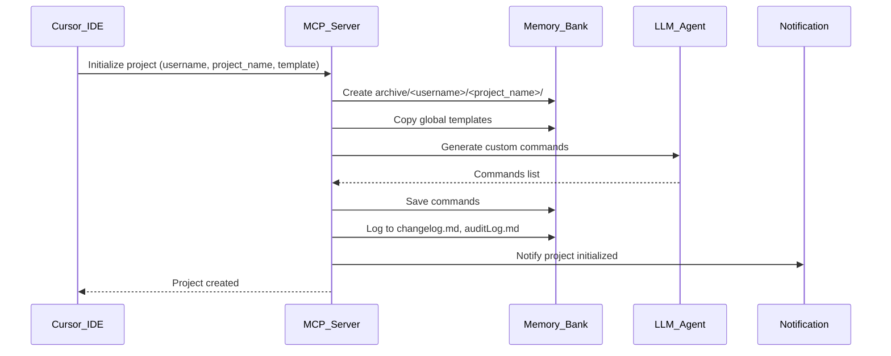
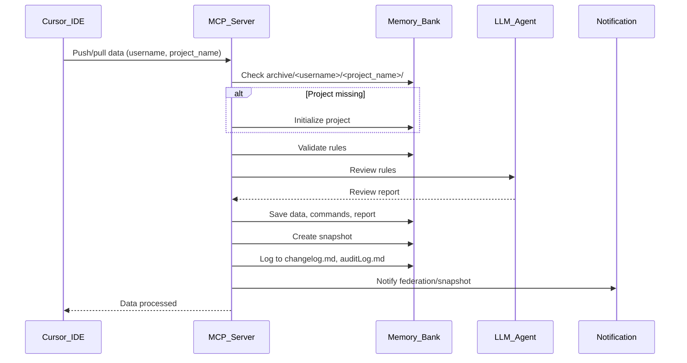
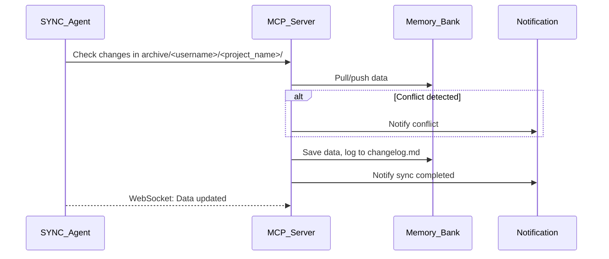
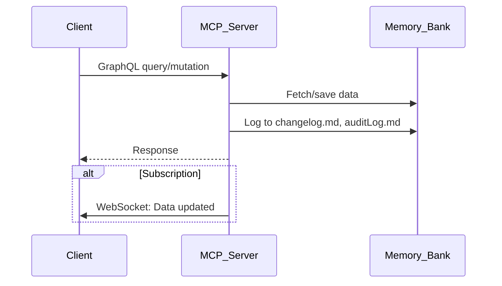
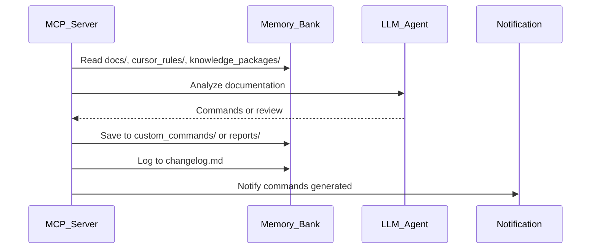
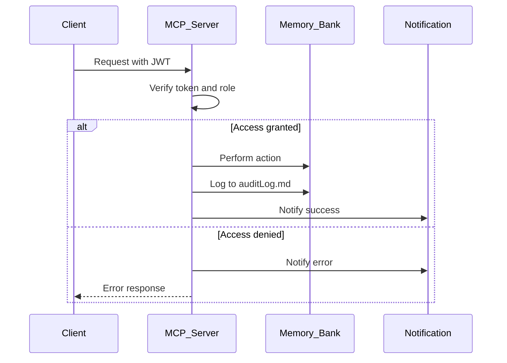
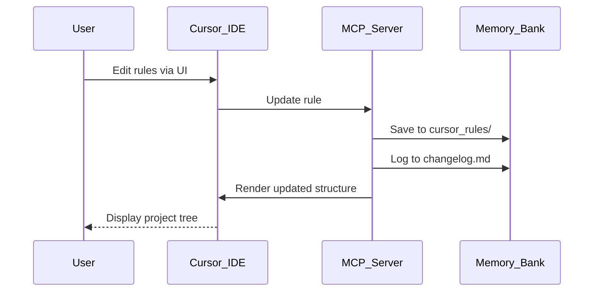
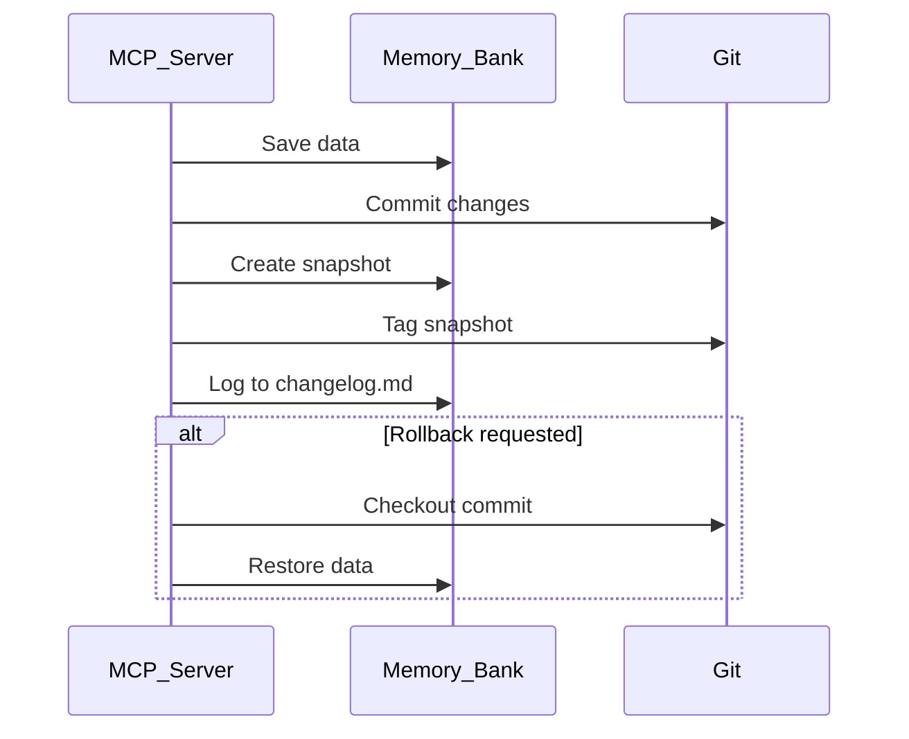
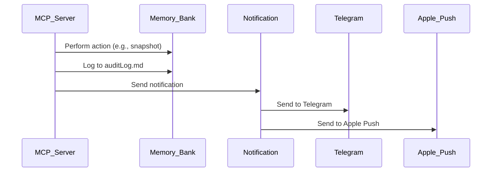

# Эпики для реализации MVP MCP-сервера с Memory Bank и LLM-интеграцией (Обновлено)

## Введение

Этот документ описывает полный набор эпиков для минимально жизнеспособного продукта (MVP) MCP-сервера, интегрированного с Memory Bank, federation, GraphQL, синхронизацией, LLM, безопасностью, UI и уведомлениями. Обновление исключает примеры кода, предоставляя чёткие текстовые описания задач, целей и результатов. Каждый эпик включает UML-диаграмму для визуализации процессов в стиле CusDev. Также обновляется `federation_backlog.md` с новыми предложениями.

**Цель MVP**:
- Создать платформу для управления задачами, знаниями и их синхронизацией.
- Автоматизировать инициализацию проектов с персонализированными папками `archive/<username>/<project_name>/`.
- Обеспечить federation с обработкой отсутствия проекта и уведомлениями (Telegram, macOS, Apple Push).
- Интегрировать LLM для чтения документации и генерации команд.
- Настроить безопасность с авторизацией и аудитом.

**Ожидаемые результаты**:
- Автоматическое создание проектов с шаблонами и кастомными командами.
- Federation с синхронизацией данных и персонализацией `username/project_name`.
- LLM-анализ документации для реализации проектов.
- Уведомления об успехах и ошибках.
- Безопасность с ролевым доступом и аудитом.

**Текущая дата и время**: 04:45 AM -03, Sunday, June 29, 2025.

---

## Язык программирования и библиотеки

**Язык**: Python 3.11 — выбран за универсальность, поддержку асинхронного программирования и богатую экосистему.

**Основные библиотеки**:
- FastAPI — для REST и WebSocket API.
- FastMCP — для создания MCP-инструментов и ресурсов.
- PyJWT — для авторизации.
- cryptography — для шифрования данных.
- aiohttp — для асинхронных HTTP-запросов (webhooks).
- redis — для ограничения запросов (rate limiting).
- pync — для macOS-уведомлений.
- python-telegram-bot — для Telegram-уведомлений.
- apns2 — для Apple Push Notifications.
- pyyaml — для работы с конфигурациями.
- pytest — для автотестов.
- Bandit, Safety, Snyk — для анализа безопасности.

**CI/CD**:
- GitHub Actions для автоматизации тестов и проверок безопасности.
- Bandit и Safety для анализа уязвимостей.

---

## Хранение данных

**Основное хранилище**:
- **`archive/<username>/<project_name>/**`: Персонализированная папка проекта, содержащая:
  - `tasks/` — файлы задач в формате JSON.
  - `cursor_rules/` — правила в формате MDC (Markdown + YAML).
  - `snapshots/` — zip-архивы снапшотов с метаданными.
  - `knowledge_packages/` — best practices и документация в Markdown.
  - `reports/` — отчёты LLM (например, ревью правил).
  - `changelog.md` — история изменений (инициализация, federation, задачи).
  - `auditLog.md` — аудит действий (пользователь, действие, время).
- **`memory-bank/**`:
  - `global_templates/` — глобальные шаблоны для правил и задач.
  - `custom_commands/<username>/<project_name>/` — кастомные команды для LLM.
  - `projects/<project_id>/templates/` — шаблоны для конкретных проектов.

**Версионирование**:
- Все файлы под git-контролем, каждое изменение фиксируется коммитом.
- Снапшоты сохраняются как zip-архивы с тегами (`snapshot-<username>-<project_name>-<datetime>`).

**Аудит**:
- Действия логируются в `auditLog.md` с указанием пользователя, действия и времени.
- Ошибки и успешные операции (например, создание снапшота) записываются в `changelog.md` и отправляются в виде уведомлений.

---

## Структура файлов и папок

```
mcp_server/
├── archive/                           # Данные проектов
│   ├── <username>/<project_name>/    # Персонализированная папка
│   │   ├── tasks/
│   │   ├── cursor_rules/
│   │   ├── snapshots/
│   │   ├── knowledge_packages/
│   │   ├── reports/
│   │   ├── auditLog.md
│   │   └── changelog.md
├── memory-bank/                      # Шаблоны и команды
│   ├── global_templates/
│   │   ├── cursor_rules_template.md
│   │   ├── tasks_template.json
│   │   └── knowledge_template.md
│   ├── custom_commands/
│   │   ├── <username>/<project_name>/
│   │   └── global/
├── config/                           # Конфигурации
│   ├── mcp.yaml
│   ├── llm.yaml
│   └── notifications.yaml
├── scripts/                         # CLI и автоматизация
│   ├── sync_agent.py
│   ├── federation_autotest_template.py
│   └── test_federation_endpoints.py
├── src/                             # Исходный код
│   ├── server/
│   ├── graphql/
│   ├── websocket/
│   └── cursor_rules/
├── tests/                           # Тесты
├── docs/                            # Документация
│   ├── README_FASTMCP.md
│   ├── EXTENDED_PROJECT_OVERVIEW.md
│   ├── rules_federation_best_practices.md
│   ├── federation_backlog.md
│   └── TASKS.md
├── Dockerfile
├── docker-compose.yml
├── requirements.txt
├── .env
└── README.md
```

**Описание**:
- `archive/<username>/<project_name>/` — персонализированные данные проекта.
- `memory-bank/custom_commands/<username>/<project_name>/` — команды LLM.
- `config/notifications.yaml` — настройки уведомлений.

---

## Эпик 1: Project Initialization and Templating

**Цель**: Автоматически создавать проекты с персонализированной папкой `archive/<username>/<project_name>/`, применяя шаблоны и генерируя кастомные команды через LLM.

**Ожидаемый результат**:
- Создание папки `archive/<username>/<project_name>/` с подкаталогами для задач, правил, снапшотов, знаний и отчётов.
- Применение глобальных шаблонов из `memory-bank/global_templates/`.
- Генерация кастомных команд LLM, сохраняемых в `memory-bank/custom_commands/<username>/<project_name>/`.
- Уведомления о создании проекта через Telegram, macOS или Apple Push.

**UML-диаграмма**:


**Задачи**:
1. Создать REST-endpoint для инициализации проекта, принимающий `username`, `project_name` и шаблон (по умолчанию "default").
2. Создать папку `archive/<username>/<project_name>/` с подкаталогами: `tasks/`, `cursor_rules/`, `snapshots/`, `knowledge_packages/`, `reports/`.
3. Скопировать шаблоны из `memory-bank/global_templates/<template_name>/`, если они есть, иначе создать пустые файлы правил и задач.
4. Отправить запрос в LLM для генерации трёх кастомных команд, сохранить их в `memory-bank/custom_commands/<username>/<project_name>/commands.yaml`.
5. Обернуть логику инициализации в MCP-инструмент для повторного использования.
6. Создать файлы `changelog.md` и `auditLog.md`, записать событие инициализации.
7. Отправить уведомление о создании проекта через Telegram, macOS или Apple Push.
8. Создать автотесты для проверки создания папки, применения шаблонов и уведомлений.
9. Добавить документацию в `docs/README_FASTMCP.md` с описанием процесса инициализации.

---

## Эпик 2: Federation

**Цель**: Обеспечить обмен данными между проектами с автоматической инициализацией отсутствующих проектов, валидацией правил, синхронизацией данных и уведомлениями.

**Ожидаемый результат**:
- Автоматическая инициализация `archive/<username>/<project_name>/` при federation.
- Валидация правил с метаданными `username/project_name`.
- Синхронизация всех данных проекта и кастомных команд.
- Уведомления о federation и снапшотах через Telegram, macOS, Apple Push.

**UML-диаграмма**:


**Задачи**:
1. Создать REST-endpoint’ы для push/pull данных, принимающие `username`, `project_name`, файл и содержимое.
2. Проверять существование `archive/<username>/<project_name>/`, запускать инициализацию, если проект отсутствует.
3. Валидировать правила в `cursor_rules/` на наличие метаданных (`username/project_name`, описание, globs).
4. Скопировать кастомные команды из `memory-bank/custom_commands/<source_username>/<source_project>/` в целевой проект.
5. Реализовать синхронизацию всей папки `archive/<username>/<project_name>/` с поддержкой dry-run для сравнения изменений.
6. Отправить правила в LLM для ревью перед push/pull, сохранить отчёт в `reports/`.
7. Создать снапшот после успешного push/pull, сохранить в `snapshots/` с тегом git.
8. Записать события в `changelog.md` и `auditLog.md`, отправить уведомления.
9. Создать автотесты для проверки federation, валидации, синхронизации и уведомлений.
10. Добавить документацию в `docs/rules_federation_best_practices.md`.

---

## Эпик 3: Synchronization

**Цель**: Настроить автоматическую синхронизацию данных между инстансами через SYNC Agent с уведомлениями о синхронизации и ошибках.

**Ожидаемый результат**:
- SYNC Agent периодически синхронизирует `archive/<username>/<project_name>/`.
- Real-time мониторинг изменений через WebSocket.
- Уведомления о синхронизации и конфликтах.

**UML-диаграмма**:


**Задачи**:
1. Создать SYNC Agent как отдельный сервис для периодической проверки изменений.
2. Реализовать pull/push данных через endpoint’ы federation.
3. Отслеживать изменения в `archive/<username>/<project_name>/` и отправлять WebSocket-события.
4. Разрешать конфликты, сравнивая метаданные (дата, версия).
5. Записывать события синхронизации в `changelog.md` и `auditLog.md`.
6. Отправлять уведомления о синхронизации и конфликтах.
7. Создать автотесты для проверки синхронизации и уведомлений.
8. Добавить документацию в `docs/EXTENDED_PROJECT_OVERVIEW.md`.

---

## Эпик 4: GraphQL

**Цель**: Реализовать GraphQL API для гибкого доступа к данным, задачам и federation.

**Ожидаемый результат**:
- GraphQL-схема для задач, правил, знаний и событий.
- Поддержка подписок для real-time обновлений.
- Интеграция с UI через Apollo Client.

**UML-диаграмма**:


**Задачи**:
1. Создать GraphQL-схему для задач, правил, знаний, команд и логов.
2. Реализовать запросы для получения данных и мутации для их изменения.
3. Настроить подписки для real-time уведомлений (например, новые задачи).
4. Ограничить доступ к мутациям и подпискам по ролям.
5. Создать автотесты для запросов, мутаций и подписок.
6. Добавить документацию в `docs/mcp_integration_usage.md`.

---

## Эпик 5: LLM Integration

**Цель**: Интегрировать LLM для чтения документации, генерации кастомных команд и ревью правил.

**Ожидаемый результат**:
- LLM анализирует `docs/`, `cursor_rules`, `knowledge_packages` для создания команд.
- Генерация команд в `memory-bank/custom_commands/<username>/<project_name>/`.
- Ревью правил перед federation с отчётами.

**UML-diag ram**:


**Задачи**:
1. Настроить конфигурацию LLM с указанием модели и API-ключа.
2. Реализовать функцию чтения документации из `docs/`, `cursor_rules`, `knowledge_packages`.
3. Создать MCP-инструмент для генерации кастомных команд на основе документации.
4. Реализовать инструмент для ревью правил перед federation.
5. Сохранять результаты в `reports/` и логировать в `changelog.md`.
6. Отправлять уведомления о сгенерированных командах или ревью.
7. Создать автотесты для проверки LLM-анализа и уведомлений.
8. Добавить документацию в `docs/README_FASTMCP.md`.

---

## Эпик 6: Security

**Цель**: Настроить авторизацию, ролевой доступ и аудит с уведомлениями об ошибках и успехах.

**Ожидаемый результат**:
- JWT-авторизация для всех операций.
- Роли: `admin`, `user`, `agent` с разграничением доступа.
- Аудит в `auditLog.md` и уведомления о действиях.

**UML-diagram**:


**Задачи**:
1. Настроить JWT-авторизацию для всех endpoint’ов, кроме логина и регистрации.
2. Реализовать роли: `admin` (полный доступ), `user` (чтение/задачи), `agent` (автоматизация).
3. Логировать все действия в `auditLog.md` с указанием пользователя и времени.
4. Ограничить запросы (rate limiting) для защиты от атак.
5. Настроить шифрование файлов в `archive/<username>/<project_name>/`.
6. Отправлять уведомления об успехах (например, создание снапшота) и ошибках.
7. Создать автотесты для проверки авторизации и уведомлений.
8. Добавить документацию в `docs/security_audit_checklist.md`.

---

## Эпик 7: UI/Visualization

**Цель**: Создать интерфейс для управления проектами, задачами и federation с визуализацией данных.

**Ожидаемый результат**:
- Web UI для управления задачами, правилами и синхронизацией.
- Визуализация структуры `archive/<username>/<project_name>/` и связей данных.
- Интеграция с Cursor IDE для редактирования правил.

**UML-diagram**:


**Задачи**:
1. Создать web UI с использованием React и Apollo Client для работы с GraphQL.
2. Реализовать страницы для задач, правил, federation и логов.
3. Отобразить структуру `archive/<username>/<project_name>/` в виде дерева.
4. Настроить редактирование правил через Cursor IDE.
5. Добавить визуализацию связей данных (например, диаграммы Mermaid).
6. Создать автотесты для UI и визуализации.
7. Добавить документацию в `docs/mcp_integration_usage.md`.

---

## Эпик 8: Git Integration

**Цель**: Интегрировать git для версионирования данных, задач и снапшотов.

**Ожидаемый результат**:
- Автоматические git-коммиты для всех изменений.
- Снапшоты в `snapshots/` с тегами.
- Возможность отката к предыдущим версиям.

**UML-diagram**:


**Задачи**:
1. Настроить git-репозиторий для `archive/<username>/<project_name>/`.
2. Создавать коммит для каждого изменения (задачи, правила, federation).
3. Сохранять снапшоты как zip-архивы с git-тегами.
4. Реализовать откат к предыдущим версиям через endpoint.
5. Логировать действия в `changelog.md`.
6. Создать автотесты для коммитов, тегов и откатов.
7. Добавить документацию в `docs/TASKS.md`.

---

## Эпик 9: Notifications

**Цель**: Настроить уведомления об успехах, ошибках и событиях через Telegram, macOS и Apple Push.

**Ожидаемый результат**:
- Уведомления о создании проектов, снапшотов, federation и ошибках.
- Поддержка Telegram, macOS и Apple Push Notifications.
- Логирование уведомлений в `auditLog.md`.

**UML-diagram**:


**Задачи**:
1. Настроить конфигурацию уведомлений в `config/notifications.yaml`.
2. Реализовать отправку уведомлений для событий: проект создан, federation выполнен, снапшот создан, ошибка.
3. Поддерживать Telegram, macOS и Apple Push Notifications.
4. Логировать уведомления в `auditLog.md`.
5. Создать автотесты для проверки отправки уведомлений.
6. Добавить документацию в `docs/EXTENDED_PROJECT_OVERVIEW.md`.

---

## Приоритеты и зависимости

**Приоритеты**:
1. **Эпик 1: Project Initialization** [P1]: База для всех операций.
   - Зависимости: `archive/`, `memory-bank/`, Эпик 5.
2. **Эпик 2: Federation** [P1]: Ключ для обмена данными.
   - Зависимости: Эпик 1, Эпик 6.
3. **Эпик 5: LLM Integration** [P1]: Необходим для команд и ревью.
   - Зависимости: `config/llm.yaml`.
4. **Эпик 6: Security** [P1]: Защита данных.
   - Зависимости: `config/mcp.yaml`, `config/notifications.yaml`.
5. **Эпик 9: Notifications** [P2]: Улучшает UX.
   - Зависимости: Эпик 6.
6. **Эпик 3: Synchronization** [P2]: Автоматизация federation.
   - Зависимости: Эпик 2.
7. **Эпик 4: GraphQL** [P2]: Гибкий API.
   - Зависимости: Эпик 6.
8. **Эпик 7: UI/Visualization** [P2]: Удобство работы.
   - Зависимости: Эпик 4.
9. **Эпик 8: Git Integration** [P2]: Версионирование.
   - Зависимости: Эпик 1, Эпик 2.

**План старта**:
- **Неделя 1**: Эпик 1 (инициализация), Эпик 5 (LLM), Эпик 6 (безопасность).
- **Неделя 2**: Эпик 2 (federation), Эпик 9 (уведомления).
- **Неделя 3**: Эпик 3 (синхронизация), Эпик 4 (GraphQL).
- **Неделя 4**: Эпик 7 (UI), Эпик 8 (git).

---

<xaiArtifact artifact_id="07583498-baff-4293-9986-589db15c25c3" artifact_version_id="71073abc-1cf7-4b43-a543-00340855192c" title="federation_backlog.md" contentType="text/markdown">

# Federation Backlog (Обновлено)

## Описание

Backlog предложений для улучшения federation в MCP-сервере, с фокусом на персонализацию `origin`, уведомления, LLM-интеграцию с документацией, безопасность и синхронизацию.

## Новые предложения

1. **Персонализация origin как username/project_name** [P1]:
   - Использовать `archive/<username>/<project_name>/` для всех данных.
   - Обновить валидацию правил для проверки `username/project_name`.

2. **Уведомления о всех операциях** [P1]:
   - Отправлять уведомления о создании проекта, federation, снапшотов, ошибках в Telegram, macOS, Apple Push.
   - Логировать уведомления в `auditLog.md`.

3. **LLM-чтение документации** [P1]:
   - LLM должен анализировать `docs/`, `cursor_rules`, `knowledge_packages` для генерации команд и рекомендаций.
   - Добавить настройку путей документации в `config/llm.yaml`.

4. **Шифрование данных при federation** [P2]:
   - Шифровать файлы перед push и дешифровать при pull.
   - Логировать попытки дешифрования в `auditLog.md`.

5. **Автоматизация снапшотов** [P2]:
   - Создавать снапшот после каждого push/pull с уведомлением.
   - Сохранять в `snapshots/` с git-тегом.

6. **Тестирование масштабируемости** [P3]:
   - Провести тесты для массового push/pull (1000+ файлов).
   - Интегрировать с CI/CD для автоматических проверок.

7. **Расширенная документация** [P3]:
   - Добавить в `docs/rules_federation_best_practices.md` примеры уведомлений и LLM-анализа.
   - Обновить `docs/EXTENDED_PROJECT_OVERVIEW.md` с персонализацией.

## Существующий backlog

- Git submodules для синхронизации правил.
- Двусторонняя синхронизация с разрешением конфликтов.
- Интеграция с внешними системами (Confluence, Notion).

## Приоритеты

1. Персонализация `origin`, уведомления, LLM-документация [P1].
2. Шифрование, снапшоты [P2].
3. Тестирование, документация [P3].

## Следующие шаги

- Настроить персонализацию и уведомления (неделя 1).
- Реализовать LLM-чтение документации и шифрование (неделя 2).
- Добавить тесты и документацию (неделя 3).
