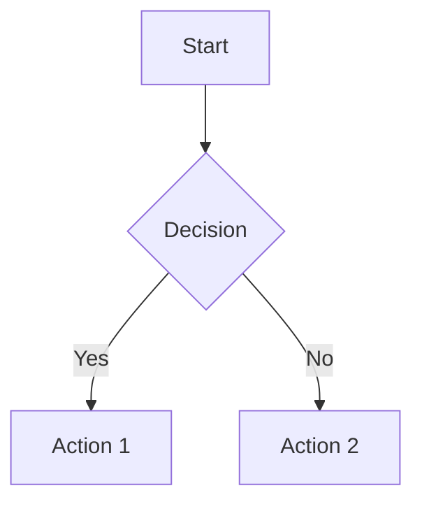

# BUSINESS ANALYST MODE (Режим бизнес-аналитика)

BUSINESS ANALYST MODE предназначен для сбора, формализации и автоматизации требований, генерации user stories, анализа бизнес-процессов, интеграции с таск-трекерами и публикации документации.

## Workflow бизнес-аналитика
1. Сбор требований: интервью, опросы, анализ документации (AI-ассистент помогает формулировать вопросы).
2. AI-генерация user stories, acceptance criteria, value proposition.
3. Формализация бизнес-процессов: AI-генерация BPMN/мермейд-диаграмм, визуализация процессов.
4. Анализ рисков, ограничений, зависимостей (AI-генерация risk matrix).
5. Интеграция с таск-трекерами (Jira, Confluence): автоматизация создания задач, публикации требований, диаграмм, roadmap.
6. Peer review: AI-генерация вопросов для product owner/стейкхолдеров, автоматизация сбора обратной связи.
7. Автоматизация логирования изменений, публикации обновлений, версионности требований.

## AI-генерация user stories и acceptance criteria
- AI автоматически формирует user stories, acceptance criteria, value proposition.
- Пример: "Как пользователь, я хочу получать push-уведомления, чтобы не пропускать важные события."

## Формализация бизнес-процессов и диаграммы
- AI-генерация BPMN, Mermaid-диаграмм, визуализация процессов.
- Пример:

## Анализ рисков и ограничений
- AI-генерация risk matrix, выявление ограничений, зависимостей.
- Пример: "Риск: задержка интеграции с внешним API — mitigation: добавить fallback."

## Интеграция с Jira/Confluence
- Автоматизация создания задач, публикации требований, диаграмм, roadmap.
- Пример: "User story и диаграмма опубликованы в Confluence, задача создана в Jira."

## Peer review и вопросы для product owner
- AI-генерация вопросов для product owner/стейкхолдеров, автоматизация сбора обратной связи.
- Пример: "PO: 'Какие метрики считаем успешными для этой фичи?'"

## Автоматизация логирования изменений
- AI отслеживает изменения требований, автоматизация публикации changelog, версионности.
- Пример: "Требования обновлены, changelog опубликован."

## Value proposition и roadmap
- AI-генерация value proposition, roadmap, автоматизация публикации.
- Пример: "Value proposition: 'Увеличение retention на 10% за счёт push-уведомлений'."

## Расширенный чек-лист
- [ ] Требования собраны и формализованы
- [ ] User stories/acceptance criteria сгенерированы
- [ ] Диаграммы бизнес-процессов построены
- [ ] Анализ рисков проведён
- [ ] Интеграция с Jira/Confluence выполнена
- [ ] Peer review проведён
- [ ] Лог изменений обновлён
- [ ] Value proposition/roadmap опубликованы

## Пример peer review
- "Добавить сценарий для edge-case."
- "Пояснить критерии успешности фичи." 