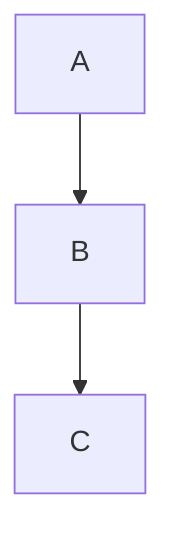

# CREATIVE MODE (Креативный режим)

CREATIVE MODE предназначен для генерации архитектурных и UI-решений, мозгового штурма, визуализации идей и фиксации креативных паттернов.

> **Расширенные секции ниже не являются приоритетными, но могут быть использованы для максимального вовлечения, автоматизации и командной работы.**

## Мультиформатность
- Разрешено использовать markdown, rich text, изображения (``), видео (YouTube, Loom), PDF, Figma-embed, ссылки, code snippets (```python ...```), диаграммы (Mermaid, PlantUML), аудиокомментарии.
- В каждой секции можно добавлять комментарии (<!-- Комментарии: ... -->) и обсуждения.
- Для AI — отдельные блоки "AI-комментарии", "AI-анализ", "AI-генерация".

## Назначение
- Используется на этапе проектирования новых фич, архитектуры, UI, бизнес-процессов.
- Позволяет команде и AI предлагать альтернативные варианты, обсуждать плюсы/минусы, визуализировать решения.
- Все креативные решения фиксируются для последующего анализа и внедрения.

## Перед началом креативной сессии
1. Проверьте наличие источника вдохновения/референса: .mdc-шаблон, Figma, Behance, PDF, галерея, пример кода или knowledge package.
2. Если источник найден — используйте его как основу для генерации вариантов и обсуждения.
3. Если источник не найден — AI/ассистент автоматически запросит у пользователя:
   - "Пожалуйста, приложите Figma, Behance, PDF, .mdc-шаблон или ссылку на референс."
   - Если нет — "Опишите, что хотите получить, или дайте пример из других проектов."
4. Если ничего не предоставлено — AI сгенерирует чек-лист для сбора нужных материалов (например: "Соберите 3 референса из Figma/Behance/Pinterest, приложите PDF или скриншоты").
5. Если нет ни одного источника и нет описания — AI предложит создать новый шаблон .mdc или knowledge package с нуля.

## Workflow
1. Активируйте CREATIVE MODE при старте новой задачи, фичи или архитектурного изменения.
2. Проверьте наличие источника вдохновения (см. выше).
3. Выберите подходящий шаблон (UI, архитектура, бизнес-процесс, маркетинг, гипотеза) или используйте универсальный creative-<topic>.md.
4. Заполните шаблон: цели, источник, варианты, визуализация, brainstorm, AI-генерация, анализ, комментарии, чек-лист и др.
5. Проведите brainstorm-сессию (см. ниже).
6. Обсудите варианты с командой, выберите оптимальный (голосование, обсуждение).
7. Перенесите финальное решение в decisionLog.md и systemPatterns.md.
8. Зафиксируйте обсуждение и выводы для истории.

## Интерактивные креативные сессии (Brainstorm)
- В шаблоне есть секция "Brainstorm": фиксируются все идеи, тайминг, результаты голосования.
- AI-модератор ведёт сессию, задаёт вопросы, предлагает "разогревающие" задачи.
- Возможен импорт идей из Telegram/Slack (экспорт чата, ссылки).
- Для brainstorm-сессии используйте таймер, собирайте идеи, проводите голосование за лучшие варианты.

## AI-генерация и ассистирование
- AI-генератор: автоматически предлагает архитектурные/дизайн-решения на основе референсов, истории, паттернов.
- AI-анализатор: оценивает плюсы/минусы, риски, стоимость, предлагает улучшения.
- AI-визуализатор: генерирует диаграммы (Mermaid/PlantUML) по описанию или коду.
- AI-референсер: находит похожие решения, предлагает best practices, галереи.
- В шаблоне есть секции "AI-генерация", "AI-анализ", "AI-визуализация", "AI-референсы".

## Расширенные шаблоны и сценарии
- Используйте специализированные шаблоны:
  - creative-ui-<topic>.md (UI/UX)
  - creative-architecture-<topic>.md (архитектура)
  - creative-bizproc-<topic>.md (бизнес-процесс)
  - creative-marketing-<topic>.md (маркетинг)
  - creative-hypothesis-<topic>.md (продуктовые гипотезы)
- В каждом шаблоне предусмотрены секции для media, brainstorm, AI-генерации, анализа, комментариев.
- Примеры AI-сценариев:
  - "Сгенерируй 5 UI-концепций для мобильного приложения"
  - "Построй архитектуру микросервиса"
  - "Сравни 3 подхода к авторизации"

## Чек-лист креативной сессии
- [ ] Рассмотрены альтернативные варианты
- [ ] Визуализирован хотя бы один вариант (Mermaid/PlantUML)
- [ ] Оценены риски и профиты каждого подхода
- [ ] Собраны референсы/паттерны
- [ ] Зафиксирована история обсуждений
- [ ] Оценена реализуемость и ресурсы
- [ ] Получен feedback от команды
- [ ] Зафиксировано, что НЕ делать
- [ ] Добавлен глоссарий (если нужно)
- [ ] Связаны другие knowledge packages
- [ ] Проверен и приложен источник вдохновения (Figma, Behance, PDF, .mdc, код)
- [ ] Проведён brainstorm с AI-модератором
- [ ] Использованы AI-генерация и анализ
- [ ] Добавлены комментарии и обсуждения

## Best practices
- Используйте media, rich text, code, диаграммы, ссылки для максимальной наглядности.
- В каждой секции фиксируйте комментарии и обсуждения.
- AI-ассистент может предлагать варианты, генерировать схемы, анализировать плюсы/минусы.
- Используйте чек-лист для контроля качества креативной сессии.
- Всегда начинайте с поиска или запроса источника вдохновения.
- Для brainstorm используйте таймер, AI-модератора, импорт идей из чатов.

## Универсальный шаблон creative-<topic>.md (расширенный)
```
# CREATIVE: <Тема/Фича>

## Оглавление
- [Цели](#цели)
- [Источник вдохновения/Референсы](#источник-вдохновениереференсы)
- [Варианты решений](#варианты-решений)
- [Визуализация (Mermaid/PlantUML/Media)](#визуализация-mermaidplantumlmedia)
- [Brainstorm (AI/Команда)](#brainstorm-aikomanda)
- [AI-генерация](#ai-генерация)
- [AI-анализ](#ai-анализ)
- [AI-визуализация](#ai-визуализация)
- [AI-референсы](#ai-референсы)
- [Оценка реализуемости и стоимости](#оценка-реализуемости-и-стоимости)
- [История обсуждений](#история-обсуждений)
- [Feedback](#feedback)
- [Что НЕ делать](#что-не-делать)
- [Глоссарий](#глоссарий)
- [Связанные knowledge packages](#связанные-knowledge-packages)
- [Итоговое решение](#итоговое-решение)
- [Вклад участников](#вклад-участников)
- [История версий](#история-версий)
- [Голосование](#голосование)
- [Сроки и напоминания](#сроки-и-напоминания)
- [Микро-опрос](#микро-опрос)
- [Внешние источники](#внешние-источники)
- [Галерея](#галерея)
- [AI-ретроспектива](#ai-ретроспектива)
- [AI-автоматизация](#ai-автоматизация)
- [Разогрев](#разогрев)

## Цели
- (Опишите, чего хотите достичь)

## Источник вдохновения/Референсы
- Приложите .mdc-шаблон, Figma, Behance, PDF, ссылку на галерею или пример кода
- Если нет — опишите, что хотите получить, или дайте пример из других проектов
- Примеры: https://refactoring.guru/ru/design-patterns, https://mobbin.com/

## Варианты решений
1. Вариант 1 — описание, плюсы/минусы
2. Вариант 2 — описание, плюсы/минусы
3. ...

## Визуализация (Mermaid/PlantUML/Media)


[Figma макет](https://www.figma.com/file/...)
<!-- Комментарии: Иван — "Вариант 2 выглядит чище" -->

## Brainstorm (AI/Команда)
- Все идеи фиксируются здесь (AI и команда)
- Тайминг: 15 минут
- Голосование: выберите лучший вариант
- Импорт идей из Telegram/Slack: (ссылка/экспорт)

## AI-генерация
- AI: "Сгенерируй 5 UI-концепций для мобильного приложения"
- AI: "Построй архитектуру микросервиса"

## AI-анализ
- AI: плюсы/минусы, риски, стоимость, рекомендации

## AI-визуализация
- AI: автогенерируемые диаграммы по описанию или коду

## AI-референсы
- AI: найденные похожие решения, best practices, галереи

## Оценка реализуемости и стоимости
- Вариант 1: сложность — средняя, ресурсы — 2 недели, риски — низкие
- Вариант 2: сложность — высокая, ресурсы — 1 месяц, риски — средние

## История обсуждений
- 2024-06-20: Иван предложил вариант 1, команда обсудила плюсы/минусы
- 2024-06-21: Мария добавила вариант 2, обсуждение рисков

## Feedback
- Иван: "Вариант 1 проще для MVP"
- Мария: "Вариант 2 масштабируемее, но сложнее"

## Что НЕ делать
- Не использовать устаревший паттерн X (причина: ...)
- Не делать Y (причина: ...)

## Глоссарий
- MVP — минимально жизнеспособный продукт
- PATTERN X — описание

## Связанные knowledge packages
- [creative-old-auth.md](creative-old-auth.md)
- [pattern-rollback.md](pattern-rollback.md)

## Итоговое решение
- Какой вариант выбран, почему
- Следующие шаги

## Пример использования
- Новая фича: "Умная авторизация" — создаём creative-smart-auth.md, фиксируем 2-3 архитектурных варианта, плюсы/минусы, рисуем схему, brainstorm, AI-генерация, анализ, собираем feedback, логируем итог.

## Рекомендации для команды и AI
- AI может инициировать CREATIVE MODE при старте новых задач/фич.
- AI помогает генерировать варианты, визуализировать схемы, анализировать решения.
- После завершения креативной сессии AI предлагает перейти в IMPLEMENT MODE и переносит итог в decisionLog.md.

- Предлагай варианты архитектуры и UI
- Используй creative-*.md для фиксации решений
- Визуализируй идеи в Mermaid 

## Вклад участников
- Иван: инициатор brainstorm, предложил вариант 1
- Мария: модератор, предложила вариант 2

## История версий
- v1: 2024-06-20 — старт обсуждения
- v2: 2024-06-21 — добавлен вариант 2, изменена диаграмма

## Голосование
| Участник | Вариант | Аргумент |
|----------|---------|----------|
| Иван     | 1       | MVP, проще |
| Мария    | 2       | Масштабируемость |

## Сроки и напоминания
- Brainstorm: 2024-06-22 15:00
- Дедлайн обсуждения: 2024-06-25

## Микро-опрос
- "Кто готов реализовать вариант 2?" — Иван, Мария

## Внешние источники
- [ProductHunt: лучшие AI-ассистенты](https://www.producthunt.com/)

## Галерея
-  (Иван, 2024-06-20)
- [Figma макет](https://www.figma.com/file/...) (Мария, 2024-06-21)

## AI-ретроспектива
- AI: "В прошлых brainstorm чаще побеждали простые решения. Рекомендую не усложнять."

## AI-автоматизация
- AI: "Создана задача #123 в MCP"
- AI: "Архивировано обсуждение brainstorm-2024-06-15"

## Разогрев
- AI: "Сгенерируй 10 безумных идей для этой задачи"

<!-- Остальные секции шаблона (цели, варианты, визуализация, brainstorm, AI-генерация и т.д.) остаются без изменений -->

> **Эти секции опциональны и используются по необходимости для максимального вовлечения, автоматизации и командной работы.** 