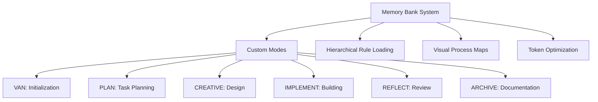

# Process Map

```mermaid
graph TD
    Main["Memory Bank System"] --> Modes["Custom Modes"]
    Main --> Rules["Hierarchical Rule Loading"]
    Main --> Visual["Visual Process Maps"]
    Main --> Token["Token Optimization"]
    Modes --> VAN["VAN: Initialization"]
    Modes --> PLAN["PLAN: Task Planning"]
    Modes --> CREATIVE["CREATIVE: Design"]
    Modes --> IMPLEMENT["IMPLEMENT: Building"]
    Modes --> REFLECT["REFLECT: Review"]
    Modes --> ARCHIVE["ARCHIVE: Documentation"]
``` 