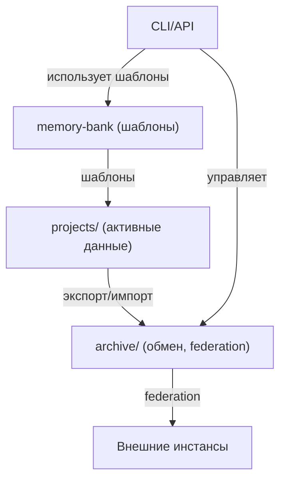

# Архитектура хранения и Federation (2024)

---

## 1. Введение
- Внедрена новая архитектура хранения знаний и federation.
- Главные цели: безопасность, масштабируемость, прозрачность обмена.
- Все обмены и federation — только через archive/<origin>/.

---

## 2. Структура хранения
- **archive/<origin>/** — для обмена, архивирования, federation.
- **memory-bank/** — только шаблоны и best practices (не для обмена рабочими данными).
- **projects/** — активные данные проектов (по необходимости).

---

## 3. Federation и обмен знаниями
- Все federation/import/export — только через archive/<origin>/.
- memory-bank — только шаблоны, не участвует в обмене.
- Валидация, безопасность, логирование всех операций.

---

## 4. CLI и API: примеры команд
```bash
python scripts/federation_cli.py export --project mcp
python scripts/federation_cli.py import --file archive/ai-assistant/export_2024-06-19.zip --project ai-assistant
```
- API:
  - `/projects/{origin}/export`
  - `/projects/{origin}/merge`
  - `/federation/{origin}/pull_knowledge`
  - `/federation/{origin}/push_knowledge`
  - (аналогично для команд и шаблонов)

---

## 5. Best practices
- Делайте бэкапы перед импортом.
- Проверяйте метаданные (origin, версия, дата).
- Все операции — только по своему origin.
- Все действия логируются (changelog, auditLog).
- memory-bank — только шаблоны, не для обмена.

---

## 6. Типовые сценарии
- Экспорт/импорт между инстансами — только через archive/<origin>/.
- Восстановление данных — только из archive/<origin>/.
- Проверка логов — в changelog/auditLog соответствующего origin.

---

## 7. Q&A и обратная связь
- Вопросы — в общий чат или issue tracker.
- Предложения по улучшению — через форму/feedback.
- Все предложения фиксируются и попадают в backlog.

---

## 8. Схема архитектуры (Mermaid)
