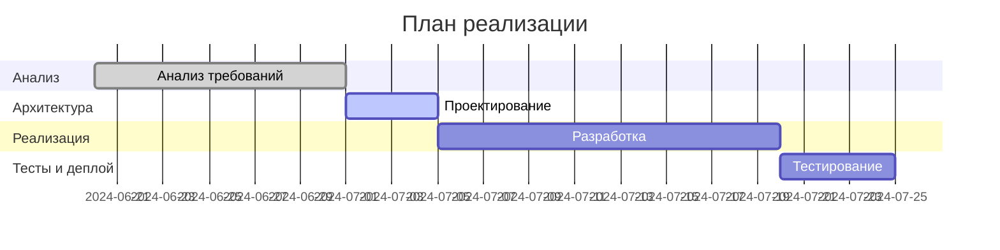

# PLAN MODE (Режим планирования)

PLAN MODE предназначен для стратегического планирования, декомпозиции задач, согласования этапов, выявления рисков и автоматизации перехода к реализации.

## AI-генерация и анализ плана
- AI автоматически предлагает структуру этапов, подзадач, зависимости, сроки на основе вводных и best practices.
- AI-анализатор выявляет риски, "узкие места", предлагает буферы, оценивает реалистичность сроков.
- AI-оптимизатор предлагает варианты оптимизации (параллелить этапы, изменить порядок, разбить крупные задачи).

## Голосование и согласование
- Команда голосует за приоритеты, сроки, критические этапы.
- AI агрегирует результаты, формирует summary.
- История правок и обсуждений логируется.

## Интеграция с календарём и напоминаниями
- AI автоматически создаёт события (этапы, дедлайны, контрольные точки) в календаре (Google Calendar/Outlook/Slack).
- Напоминания о дедлайнах, необходимости ревью, согласования плана.

## Lessons Learned (AI-ретроспектива)
- AI анализирует прошлые планы, выявляет типовые ошибки, предлагает улучшения.
- Секция "Lessons Learned" формируется после завершения проекта.

## История изменений
- Логируются все изменения, комментарии, предложения по плану.

## Гибкая декомпозиция и динамическое перепланирование
- AI-помощник предлагает, как лучше разбить крупные задачи, оценивает трудоёмкость.
- При изменении условий AI предлагает обновить план, пересчитать сроки, перераспределить задачи.

## Связь с другими режимами и задачами
- Прямые переходы к CREATIVE/IMPLEMENT, автоматическое подтягивание целей, решений, ограничений.
- После согласования плана AI создаёт шаблоны задач для реализации.

## Интеграция с таск-трекером и внешними системами
- Все изменения в плане автоматически отражаются в таск-трекере (Jira, MCP, GitHub Issues).
- Импорт/экспорт плана, статусов, обсуждений.

## Безопасность и контроль доступа
- Гибкие права: кто может редактировать, утверждать, комментировать план.
- AI-мониторинг изменений: логирует все правки, уведомляет о критических изменениях.

## Пример расширенного шаблона plan-<topic>.md
```
# PLAN: Новый API для Smart Auth

## Вводные и цели
- Реализовать быстрый и безопасный API для авторизации
- Ожидаемый результат: время отклика < 150мс, покрытие тестами > 85%

## Критерии успеха
- [ ] Реализовано в срок
- [ ] Покрытие тестами > 85%
- [ ] Принято заказчиком

## Ограничения и риски
- Ограничения: бюджет 2 недели, только Python/Node.js
- Риски: задержки интеграции с внешним сервисом, нехватка тестовых данных

## Структура плана и этапы
- Этап 1: Анализ требований (до 2024-07-01)
- Этап 2: Проектирование архитектуры (до 2024-07-05)
- Этап 3: Реализация (до 2024-07-20)
- Этап 4: Тестирование и деплой (до 2024-07-25)

## Подзадачи и ответственные
- [ ] Составить ТЗ — Иван
- [ ] Нарисовать схему — Мария
- [ ] Настроить CI/CD — Андрей

## Визуализация плана (Mermaid/Gantt)


## AI-анализ и оптимизация
- AI: "План слишком сжат — рекомендую добавить буфер на тесты."
- AI: "Можно параллелить этапы 'UI' и 'Backend'."
- AI: "В прошлом проекте задержка была из-за интеграции — учтите это."

## Голосование и согласование
| Участник | Приоритет этапа | Аргумент |
|----------|-----------------|----------|
| Иван     | 1 (Архитектура) | Критично для старта |
| Мария    | 2 (UI)          | Можно делать параллельно |

## Календарь и напоминания
- Этап "Тесты" — дедлайн 2024-07-20 (событие в Google Calendar)
- Напоминание: "Через 2 дня ревью плана!"

## Lessons Learned (AI-ретроспектива)
- AI: "В прошлых планах не хватало времени на багфиксы — добавлен буфер."
- AI: "Рекомендую после каждого этапа проводить мини-ретроспективу."

## История изменений
- 2024-06-25: Иван добавил этап "Интеграция с внешним API"
- 2024-06-26: Мария предложила увеличить время на тесты

## Чек-лист планирования
- [x] Вводные и цели определены
- [x] Критерии успеха согласованы
- [x] Риски и ограничения зафиксированы
- [x] План визуализирован
- [x] Подзадачи заведены в tasks.md
- [ ] План согласован с командой

## Что НЕ делать
- Не планировать без учёта внешних зависимостей
- Не забывать про буферы на тесты и багфиксы

## Source of Truth (tasks.md)
- Все задачи и статусы отражены в [tasks.md](../tasks.md)

## Ретроспектива и feedback
- Что сработало: раннее выявление рисков, визуализация
- Что не сработало: не хватило времени на тесты
- Предложение: всегда закладывать буфер на интеграцию 